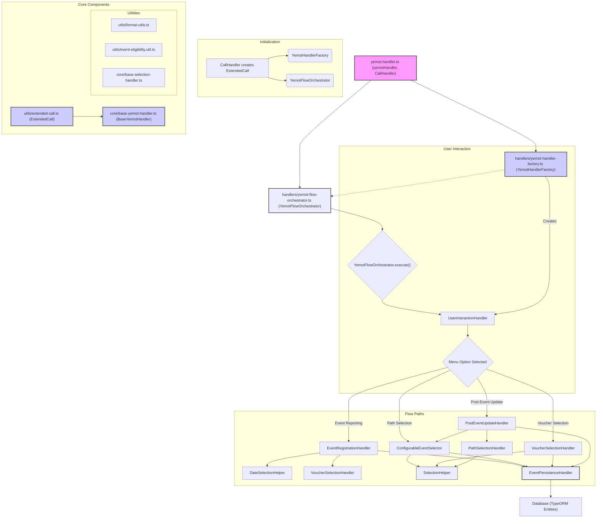

```mermaid
graph TD
    A["yemot-handler.ts (yemotHandler, CallHandler)"] --> B["handlers/yemot-handler-factory.ts (YemotHandlerFactory)"];
    A --> C["handlers/yemot-flow-orchestrator.ts (YemotFlowOrchestrator)"];
    B -.-> C; 
    
    subgraph Initialization
        direction LR
        Init1[CallHandler creates ExtendedCall] --> Init2(YemotHandlerFactory)
        Init1 --> Init3(YemotFlowOrchestrator)
    end

    C --> D{"YemotFlowOrchestrator.execute()"};

    subgraph User Interaction
        direction LR
        D --> E["UserInteractionHandler"];
        B -- Creates --> E;
        E --> F{"Menu Option Selected"};
    end

    subgraph Flow Paths
        direction LR
        F -- Event Reporting --> G["EventRegistrationHandler"];
        F -- Path Selection --> K["ConfigurableEventSelector"];
        F -- Voucher Selection --> O["VoucherSelectionHandler"];
        F -- Post-Event Update --> P["PostEventUpdateHandler"];
        
        G --> H["DateSelectionHelper"];
        G --> I["VoucherSelectionHandler"];
        K --> L["SelectionHelper"];
        O --> L;
        P --> K;
        P --> R["PathSelectionHandler"];
        R --> L;
        
        G --> J["EventPersistenceHandler"];
        K --> J;
        O --> J;
        P --> J;
    end

    J --> S["Database (TypeORM Entities)"];

    subgraph Core Components
        direction LR
        CC1["utils/extended-call.ts (ExtendedCall)"]
        CC2["core/base-yemot-handler.ts (BaseYemotHandler)"]
        CC1 --> CC2
        
        subgraph Utilities
            direction LR
            U3["utils/format-utils.ts"]
            U4["utils/event-eligibility.util.ts"]
            U5["core/base-selection-handler.ts"]
        end
    end

    style A fill:#f9f,stroke:#333,stroke-width:2px
    style B fill:#ccf,stroke:#333,stroke-width:2px
    style C fill:#lightgreen,stroke:#333,stroke-width:2px
    style L fill:#tan,stroke:#333,stroke-width:1px
    style J fill:#orange,stroke:#333,stroke-width:2px
    style CC1 fill:#ccf,stroke:#333,stroke-width:2px
    style CC2 fill:#ccf,stroke:#333,stroke-width:2px
```
